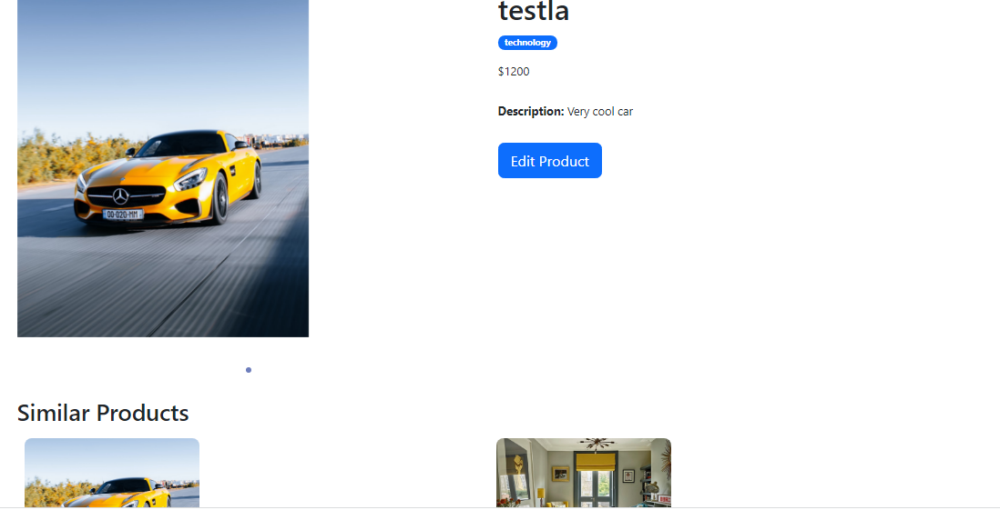

### Introduction
A fullstack project: my Store app with RESTful service 
### The service should allow:
- aesthetic UI interfaces and components;
- scalable API;
### Hosting:
- Link to Project task: https://store-frontend-ten.vercel.app
- API endpoints users: https://simple-product-store.fly.dev/users
- API endpoints products: https://simple-product-store.fly.dev/products
### Tests:
- API routes were tested to suit various use cases
### Tools used:
- VS code
- Postman
### Solution
The solution to implement this simple product store service was done through the microservices architecture. The pattern used was the MVC which involves the combination of models(database models), views(from the client)
and controllers(The backend routes).
Backend technologies: Node js(javascript) and Express js
Database: MongoDB (NoSQL)
Other dependencies(On the server): express, mongoose, nodemon, bcrypt-encryption, cors, dotenv, cloudinary and validator. 
Other dependencies(On the client side): react router dom, bootstrap, react-bootstrap, react-router-boootstrap, axios, react-thunk, react-redux, 
redux-persist, font-awesome and react-alice-carousel.
### Starting the server
A basic express server was created, common JS syntax was used. The middlewares and other neccessary endpoints were initialized. 
To start the server - cd into the folder and use 'npm run dev'
### Connecting to the Database
The server was then connected to MongoDB using mongoose and the env was used to store sensitive credentials. 
### Create User
This is an unauthenticated route where users can create and register their details. The models and controls enabled the required user validation and the response to 
each http request.
### Login User
This is the next step of authentication. The models and controls for this route enabled the required user validation and the response to each http request.

### On the Frontend
The implementation of the client side was done through React pages, specifically using the create-react-app, this generates a boiler-plate where our app can be rendered.
To start the React app - cd into the folder and use 'npm start'
The routing on the frontend was employed using react-router-dom. The basic components such as navigation and home pages were rendered, react-bootstrap anad custom css was
used to handle styling for each component and page. The login and signup display was included on the frontend.

### Connection to service
To fetch data from our server to the client side, axios was used to retrieve data from the api endpoints. It was created as a seperate file
### Handling state management 
To provide data across all components and pages of our application, redux toolkit was used. The store, reducers and actions were created and dispatched as required. mutations 
was done to provide update to the server and the redux thunk was implemented to handle asynchronous requests effectively.
### Creating products
This feature can be implemented both on the frontend and backend of our application. On the backend, the neccessary models and controls were created and connected to the database.
### Handling product requests 
Products can be created on the clients slide through the new products page, basic details of each product and pictures can be uploaded
through the cloudinary widget. This feature helps us upload images from websites and locally. After this, the products are displayed on the homepage.

This was done through basic http requests to handle CRUD operations for the products. To create/post product, to get all products or a single product / get similar products / get 
products by category(for further filtering and querying), Updating products and Deleting products for the Admin only.
### Handling product requests on the frontend
This was done through basic http requests to handle CRUD operations for the products. To create/post product, to get all products or a single product / get similar products / get 
products by category(for further filtering and querying), Updating products and Deleting products for the Admin only.
### Getting single product
A user can check the complete details of a particular product, get its name, description and price, as well view ite category and he can also compare with similar products.

### Admin functionality
A non administrative user can only have access to the cart and orders page and will be redirected to the homepage for every bad request. An admin user on the otherhand has 
the complete access to the database and can manipulate features within the application easily, thus improving data management. An admin user can delete and update product. The dashboard
is rendered in the dashboard product strictly for the admin.

### Features that can be added:
- extensive login functionality to handle protected route
- Creating and improving the cart and orders pages
- Adding a payment option such as stripe
- Pagination
- Advanced filtering, searching and sorting
